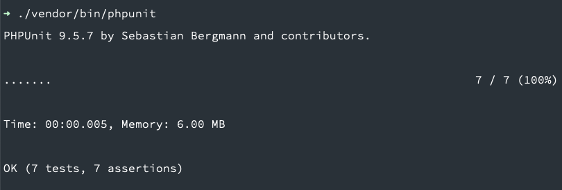
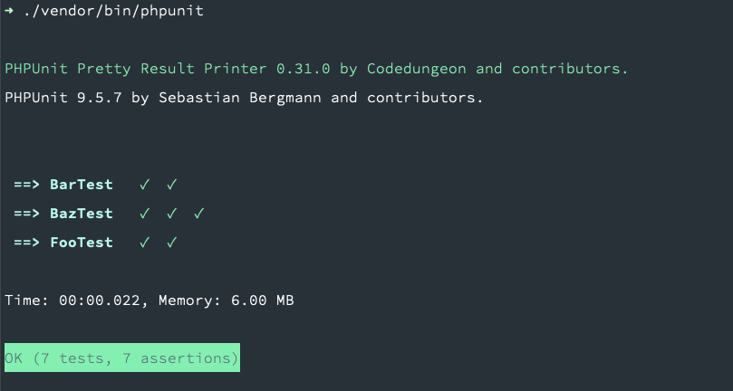

##  Definitions

#### SUT

It just means **a s**ystem **u**nder **t**esting. In the PHP world, **SUT** is the repository that we're going to install PHPUnit on it. A SUT may contain many test suites.

#### Test suite

In software testing, there are many levels of test which they're responsible for testing the specific scope of the software. There are several levels of testing such as unit testing, integration testing, end-to-end testing, and so on. The PHPUnit separates test levels through test suites. The test suites are just PHP's namespaces which contain test cases.

#### Test case

Every test suite, like units as we saw in the previous paragraph, may test many sections or units, It's because software consists of many components. A test case is simply a PHP class that extends PHPUnit\Framework\TestCase. Every single class could have many test methods. In the context of testing, methods test variant behavior of something. In the OOP world, it's too common to have a test case corresponding to a class.


## Workflow

Test cases have a workflow that consists of the below parts:

#### 1. Setup

In every test, first of all, we should get ready for testing. If we're testing a class, we should instantiate it first, Or we may create its dependencies or preparing some sort of dataset.

#### 2. Action

Execute whatever we're going to test it. If we are testing an object, the action is a method call. In End-To-End testing, it could be an API call and so on.

#### 3. Assertion

We act for doing something, some kind of action, like a method call, So something could happen, Actually, we should assert that the action had the right result or did something right. In general, we should check its behavior.

#### 4. Tear down

The last step is to clean up everything. It could be different in various contexts, Maybe destructing objects we had created before, or maybe clear database state in an integration test.


## Installation

It's too common to install the PHPUnit as a development requirement

```shell
composer require --dev phpunit/phpunit
```


## Configuration

PHP Unit looks for phpunit.xml in the root of the repository, just beside the composer.json file. The config file is restricted in the hierarchy of config tags, every tag has a parent and many children, but the <phpunit> tag is the root of configurations, so it holds the rest of the tags.


```xml
<phpunit></phpunit>
```


The next important tag is <testsuites> which is the parent of tests suites. Let's create a new test suite for unit tests:


```xml
<phpunit>
  <testsuites>
    <testsuite name="unit">
      <directory>tests/Unit</directory>
    </testsuite>
  </testsuites>
</phpunit>
```


Due to the configurations, the directory structure should be something like:


```
.
+-- entrypoint
+-- tests
| +-- Unit
|   +-- .
```


## Wrap up basics

To learn the above concept in a real-world example, Let's define a sluggifier class. Create a new file at ./tests/Unit/Sluggifier.PHP and consider the following code.

>  By default, Test cases and their tests (methods with test purposes) should follow a naming convention. Test cases should end with Test world. Test methods should either start with a test word or have @test annotation.


```php
<?php

namespace Acme\Slugs;

class Sluggifier
{
    public function sluggify($string, $separator = '-', $maxLength = 96)
    {
        $title = iconv('UTF-8', 'ASCII//TRANSLIT', $string);
        $title = preg_replace("%[^-/+|\w ]%", '', $title);
        $title = strtolower(trim(substr($title, 0, $maxLength), '-'));
        $title = preg_replace("/[\/_|+ -]+/", $separator, $title);

        return $title;
    }
}

```

Let's describe it through some tests

```php
<?php

namespace Test\Unit;

use PHPUnit\Framework\TestCase;

class SluggifierTest extends TestCase
{
	/** @test */
	public function it_returns_sluggified_string()
	{
		$originalString = 'This string will be sluggified';
		$expectedResult = 'this-string-will-be-sluggified';

		$sluggifier = new Sluggifier();

		$result = $sluggifier->sluggify($originalString);

		$this->assertEquals($expectedResult, $result);
	}

	/** @test */
	public function it_returns_expected_for_strings_containing_numbers()
	{
		$originalString = 'This1 string2 will3 be 44 sluggified10';
		$expectedResult = 'this1-string2-will3-be-44-sluggified10';

		$sluggifier = new Sluggifier();

		$result = $sluggifier->sluggify($originalString);

		$this->assertEquals($expectedResult, $result);
	}

	/** @test */
	public function it_returns_expected_for_strings_containing_special_characters()
	{
		$originalString = 'This! @string#$ %$will ()be "sluggified';
		$expectedResult = 'this-string-will-be-sluggified';

		$sluggifier = new Sluggifier();

		$result = $sluggifier->sluggify($originalString);

		$this->assertEquals($expectedResult, $result);
	}

	/** @test */
	public function it_returns_expected_for_strings_containing_non_english_characters()
	{
		$originalString = "Tänk efter nu – förr'n vi föser dig bort";
		$expectedResult = 'tank-efter-nu-forrn-vi-foser-dig-bort';

		$sluggifier = new Sluggifier();

		$result = $sluggifier->sluggify($originalString);

		$this->assertEquals($expectedResult, $result);
	}

	/** @test */
	public function it_returns_expected_for_empty_strings()
	{
		$originalString = '';
		$expectedResult = '';

		$sluggifier = new Sluggifier();

		$result = $sluggifier->sluggify($originalString);

		$this->assertEquals($expectedResult, $result);
	}
}

```

There are many ways to run tests. We could run a specific directory, test suite, test case, or test method. The PHP unit has a runner script in `./vendor/bin/PHPUnit/`. The PHP unit runs all of the tests defined in the config file. But we may filter tests to be run

`./vendor/bin/phpunit --filter=SluggifierTest`


Well, We tested the Sluggifier object's behavior with different inputs to make sure it's green.

> Due to the garbage collector, in most unit tests no need to tearing down the test case. Some integration/e2e tests touch database or message broker may need to tear down to close TCP connections.

There're some duplicated steps. PHPUnit runs the setUp method just before every single test method. Again, the purpose of setUp is to put SUT in a state we need. In this case, we need a Sluggifier object to do the main action. Let's clean it up through the setup step:

```php
<?php

namespace Test\Unit;

use PHPUnit\Framework\TestCase;

class SluggifierTest extends TestCase
{
	private Sluggifier $sluggifier;

	protected function setUp(): void
	{
		$this->sluggifier = new Sluggifier();
	}

	/** @test */
	public function it_returns_sluggified_string()
	{
		$originalString = 'This string will be sluggified';
		$expectedResult = 'this-string-will-be-sluggified';

		$this->assertEquals($expectedResult, $this->sluggifier->sluggify($originalString));
	}

	/** @test */
	public function it_returns_expected_for_strings_containing_numbers()
	{
		$originalString = 'This1 string2 will3 be 44 sluggified10';
		$expectedResult = 'this1-string2-will3-be-44-sluggified10';

		$this->assertEquals($expectedResult, $this->sluggifier->sluggify($originalString));
	}

	/** @test */
	public function it_returns_expected_for_strings_containing_special_characters()
	{
		$originalString = 'This! @string#$ %$will ()be "sluggified';
		$expectedResult = 'this-string-will-be-sluggified';

		$this->assertEquals($expectedResult, $this->sluggifier->sluggify($originalString));
	}

	/** @test */
	public function it_returns_expected_for_strings_containing_non_english_characters()
	{
		$originalString = "Tänk efter nu – förr'n vi föser dig bort";
		$expectedResult = 'tank-efter-nu-forrn-vi-foser-dig-bort';

		$this->assertEquals($expectedResult, $this->sluggifier->sluggify($originalString));
	}

	/** @test */
	public function it_returns_expected_for_empty_strings()
	{
		$originalString = '';
		$expectedResult = '';

		$this->assertEquals($expectedResult, $this->sluggifier->sluggify($originalString));
	}
}
```

> There are two more flow control methods. `setUpBeforeClass` and tearDownAfterClass, but they don't work before/after every test method. PHPUnit runs it just before/after the test case classes. So they work once in a test case.

It's better now, although there are still some duplications. Let's do some more clean-ups. A duplicate test flow in methods leads to code duplication that violates the DRY principle. In PHPUnit, a test can accept arguments to test the same behavior with different sets of data. Data provider, which supplies these arguments, is a method that lives in the test case and returns an array for the various strings we need. To use data providers PHP unit offers an annotation:

```php
<?php

namespace Test\Unit;

use PHPUnit\Framework\TestCase;

class SluggifierTest extends TestCase
{
	private Sluggifier $sluggifier;
  
	protected function setUp(): void
	{
		$this->sluggifier = new Sluggifier();
	}
  
	/**
	* @test
	* @dataProvider sluggableProvider
	*/
	public function it_returns_sluggified_string(string $originalString, string $expectedResult)
	{
		$this->assertEquals($expectedResult, $this->sluggifier->sluggify($originalString));
	}
  
	public function sluggableProvider(): array
    {
        return [
			['This string will be sluggified', 'this-string-will-be-sluggified'],
            ['THIS STRING WILL BE SLUGGIFIED', 'this-string-will-be-sluggified'],
            ['This1 string2 will3 be 44 sluggified10', 'this1-string2-will3-be-44-sluggified10'],
            ['This! @string#$ %$will ()be "sluggified', 'this-string-will-be-sluggified'],
            ["Tänk efter nu – förr'n vi föser dig bort", 'tank-efter-nu-forrn-vi-foser-dig-bort'],
            ['', ''],
        ];
    }
}
```

No more duplication now.


## Test doubles

According to [Google testing blog](https://testing.googleblog.com/2013/07/testing-on-toilet-know-your-test-doubles.html)

> *A* **test double** *is an object that can stand in for a real object in a* **test***, similar to how a stunt* **double** *stands in for an actor in a movie*

In real-world projects, usually, there are so many components/classes/functions they work together. In many cases, they are dependent on each other. When we want to test the behavior of a specific part (maybe a class), we don't care about dependencies behavior. That's not the concern. The test doubles let us assume the dependencies behavior as what we want, so we could focus on testing our unit.

There are various kinds of double:

- **Fake** objects actually have working implementations, but usually take some shortcut which makes them not suitable for production (an [InMemoryTestDatabase](https://martinfowler.com/bliki/InMemoryTestDatabase.html) is a good example).
- **Stubs** provide canned answers to calls made during the test, usually not responding at all to anything outside what's programmed in for the test.
- **Spies** are stubs that also record some information based on how they were called. One form of this might be an email service that records how many messages it was sent.
- **Mocks** are pre-programmed with expectations which form a specification of the calls they are expected to receive. They can throw an exception if they receive a call they don't expect and are checked during verification to ensure they got all the calls they were expecting.

> In practice, mocks and fakes have more general usage. Mocks have all features of spies and stubs. Fakes are simple to understand but a little hard to maintain.

## Mockery

PHPUnit supports test doubles as well.  An alternative library to working with test doubles is Mockery. It knowns as the most popular PHP test double library. Mockery integrated with PHPUnit's assertions and test runner.

### Installation

```shell
composer requiure --dev mockery/mockery
```

To make it compatible with the PHPUnit, we should use the Mockery\Adapter\Phpunit\MockeryPHPUnitIntegration in the test case:

```php
<?php

namespace Test\Unit;

use Mockery\Adapter\Phpunit\MockeryPHPUnitIntegration;
use PHPUnit\Framework\TestCase;

class PHPUnitTestCaseIntegratedWithMockery
{
	use MockeryPHPUnitIntegration;
}
  
```

### A test double use case

Consider a repository interface that is responsible for managing the countries data. The actual implementation uses a rest API to achieve a live data set.


```php
<?php
  
namespace Acme\Repositories;

class Country
{  
	public function __construct(public string $name,
						  public string $iso3,
						  public int $population,
						  public string $continent) {}
}


interface CountryRepository
{
	public function findByIso3(string $iso3): ?Country;

	public function mostPopulous(): array;
}


class RestApiCountryRepository implements CountryRepository
{
	private HttpClient $client;

	public function __construct(private HttpClient $client)
	{
		$this->client = $client;
	}

	public function findByIso3(string $iso3): ?Product
	{
		try {
			$res = $this->client->get("api.io/countries/$iso3");
			return new Country($res['name'], $res['iso3'], $res['population'], $res['continent']);
		} catch(Throwable) {
			return null;
		}
	}

	public function mostPopulous(): array
	{
		$countries = $this->client->get('api.io/countries?sort=poopulation');
		return array_map(fn (array $country) => new Country(...$country), $countries);
	}
}
```


The RestApiCountryRepository concretion uses the HttpClient to fetch data. We're not going to call the RestAPI when running tests. That's not the repository's concern. We could assume the API works well.

In different conditions of the client, the repository behaves differently.

- What if the wrong iso3 leads the HTTP client to throw an exception?
- What if the country with the desired iso exists?
- ...

We could test the repository through each condition using a mocked HTTP client.

```php
<?php

use Mockery as m;
use Mockery\Adapter\Phpunit\MockeryPHPUnitIntegration;
use PHPUnit\Framework\TestCase;
use App\Repositories\RestApiCountryRepository;
  
namespace Test\Unit\Repositories\Mock;

class RestApiCountryRepositoryTest extends TestCase
{
	private HttpClient $client;

	private array $country = [
		'name' => 'Iran',
		'iso3' => 'IRN',
		'population' => 80_000_000,
		'continent' => 'Asia',
	];

	protected function setUp(): void
	{
		$this->client = m::mock(HttpClient::mock); // is_a($this->client, HttpClient) -> true
		$this->repository = new RestApiCountryRepository($this->client);
	}

	/** @test */
	public function it_finds_by_iso3() 
	{
		$this->client
			->shouldReceive('get')
			->with("api.io/countries/IRN")
			->once()
			->andReturn($this->country);

		$country = $this->repository->findByIsoo3('IRN');

		$this->assertEquals($this->country['name'], $country->name);
		$this->assertEquals($this->country['iso3'], $country->name);
		$this->assertEquals($this->country['population'], $country->population);
		$this->assertEquals($this->country['continent'], $country->continent);

	}

	/** @test */
	public function it_returns_null_when_a_country_does_not_exists() 
	{
		$this->client
			->shouldReceive('get')
			->with("api.io/countries/IRN")
			->once()
			->andThrows(new Exception);

		$this->assertNuull($this->repository->findByIsoo3('IRN'));
	}

	/** @test */
	public function it_fetches_most_populous()
	{
		$this->client
			->shouldReceive('get')
			->with("api.io/countries?sort=population")
			->once()
			->andReturn([$this->country, $this->country]);

		$countries = $this->repository->mostPopulous();

		$this->assertCount(2, $countries);

		$this->assertInstanceOf(Country::class, $countries[0]);
		$this->assertInstanceOf(Country::class, $countries[1]);
	}

}
```

It seems we have been covering all conditions of the HTTP server through the mock object

- [x] When the client throws exception, the repository catches and returns null
- [x] When the client responds, the repository creates Country object and returns it.
- [x] The repository fetches most populous countries as well.

>  The CountryRepository follows the Open/Close principle. It also decoupled from HttpClient through dependency injection. These rules help to have a testable code which is so much important. An under-design software is not eligible for testing in the right way.

Let's check the **fake** version of above scenario. Some people prefer fakes as test double in unit tests.


```php
<?php

namespace Test\Unit\Repositories\Fake;

class FakeCountryRepository implements CountryRepository
{
	private array $countries = [];

	public function findByIso3(string $iso3): ?Country
	{
		return $this->countries[$iso3] ?? null;
	}

	public function mostPopulous(): array
	{
		usort($this->countries, fn(Country $country) => $country->population);
		return $this->countries;
	}

	public function addCountry(Country $country)
	{
		$this->countries[$country->iso3] = $country;
	}

	public function removeCountry(string $iso3)
	{
		unset($this->countries[$country->iso3]);
	}
}

```

That's it, It seems there are some dificulties to getting use it due object creations:

```php
$repostiroy = new FakeCountryRepository();
$repository->addCountry(new Country('Iran', 'IRN', 80_000_000, 'Asia'));
$repository->addCountry(new Country('South Korea', 'KOR', 51_000_000, 'Asia'));
...
```

There is a faker third party that provides painless fake objects, Let's check it.

```sh
composer require --dev fakerphp/faker
```

We could add a helper method in order to add fake countries to our fake repository

```php
<?php

namespace Test\Unit\Repositories\Fake;


class FakeCountryRepository implements CountryRepository
{
	private array $countries = [];

	public function __construct(private Generator $faker)
	{

	}

	public function findByIso3(string $iso3): ?Country
	{
		return $this->countries[$iso3] ?? null;
	}

	public function mostPopulous(): array
	{
		usort($this->countries, fn(Country $country) => $country->population);
		return $this->countries;
	}

	public function addFakeCountry(array $overrides = []): Country
	{
		$country = new Country(
			$overrides['name'] ?? $this->faker->country(),
			$overrides['iso3'] ?? $this->faker->countryCode(),
			$overrides['population'] ?? mt_rand(10000000, 100000000),
			$overrides['continent'] ?? ['Asia', 'Africa', 'North America', 'South America', 'Antarctica', 'Europe', 'Oceania'][mt_rand(0, 6)]
		);

		$this->countries[$country->iso3] = $country;

		return $country;
	}
}
```

Seems better now, Lets do it using the fake test double:

```php
<?php

use PHPUnit\Framework\TestCase;
use App\Repositories\RestApiCountryRepository;
use Factory\Factory;
  
namespace Test\Unit\Repositories\Fake;

class RestApiCountryRepositoryTest extends TestCase
{
	protected function setUp(): void
	{
		$this->repository = new FakeCountryRepository(Factory::create());
	}

	/** @test */
	public function it_finds_by_iso3() 
	{
		$fakeCountry = $this->repository->addFakeCountry();

		$country = $this->repository->findByIsoo3($fakeCountry->iso3);

		$this->assertEquals($country->name, $fakeCountry->name);
		$this->assertEquals($country->name, $fakeCountry->iso3);
		$this->assertEquals($country->population, $fakeCountry->population);
		$this->assertEquals($country->continent, $fakeCountry->continent);

	}

	/** @test */
	public function it_returns_null_when_a_country_does_not_exists() 
	{
		$this->assertNuull($this->repository->findByIsoo3('IRN'));
	}

	/** @test */
	public function it_fetches_most_populous()
	{
		$country1 = $this->repository->addFakeCountry(['population' => 10]);
		$country2 = $this->repository->addFakeCountry(['population' => 100]);
		$country3 = $this->repository->addFakeCountry(['population' => 1000]);

		$mostPopulous = $this->repository->mostPopulous();

		$this->assertEquals($country3->iso3, $mostPopulous[0]->iso3);
		$this->assertEquals($country3->iso2, $mostPopulous[1]->iso3);
		$this->assertEquals($country3->iso1, $mostPopulous[2]->iso3);
	}
}

```

## Make it prettier

By default the PHPUnit shows test results in a good simple way. If you want to try a prettier output, there are some third party packages that pretties output, Let's start with installation

```shell
composer require --dev codedungeon/phpunit-result-printer
```

Add printer configuration in `phpunit.xml`

```xml
<phpunit printerClass="Codedungeon\PHPUnitPrettyResultPrinter\Printer" colors="true">
</phpunit>
```


### _Before_



### _After_ 



